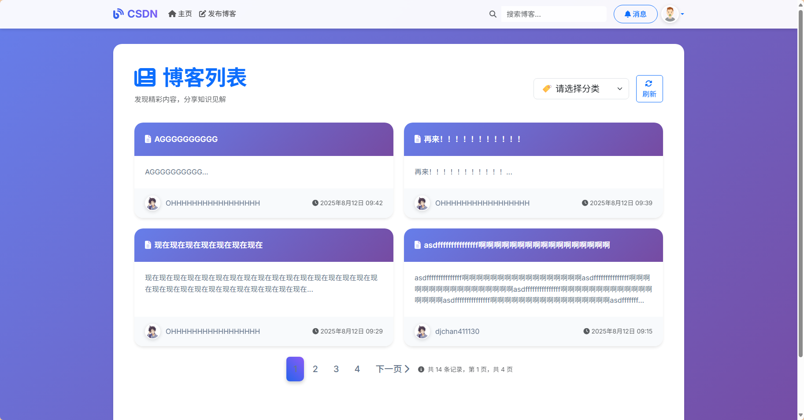

# CSDN-demo
这是一个Django学习项目，构建了一个仿CSDN的简易博客系统，使用了Bootstrap框架进行前端页面的设计和布局。

## 技术栈
- 后端：Django
- 前端：Bootstrap / Jquery
- 数据库：MySQL
- 缓存：Redis
- 其他：wangEditor / highlight.js

> 注册时的验证码服务由QQ邮箱提供，需要在QQ邮箱中开启SMTP服务并获取授权码。
> 使用的随机头像API: https://api.dicebear.com/9.x/avataaars/svg?seed=xxx

## 🚀 快速开始
### 1. 安装依赖
```bash
# 创建虚拟环境
python -m .venv .venv
.venv\Scripts\activate
```

### 2. 数据库配置
1. 创建MySQL数据库 `csdn`
2. 修改 `csdn/settings.py` 中的相关配置
3. 初始化数据库
```bash
python manage.py makemigrations
python manage.py migrate
python manage.py createsuperuser
```

### 3. 启动服务
```bash
# python manage.py collectstatic # 在部署前需要运行以下命令收集静态文件

# 终端1：启动Django开发服务器（Django自动启动Daphne以支持WebSocket）
python manage.py runserver

# 终端2：Windows环境下启动Celery Worker（当前celery只用于异步发送邮件）
celery -A csdn worker -l info -P solo
# 或者：celery -A csdn worker -l info -P threads --concurrency=4
```

## 截图

